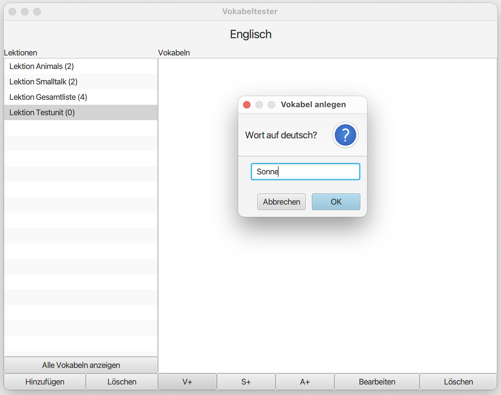

# Main (Main)

The software project is a vocabulary management program using the Model-View-Controller pattern. The program is designed with a detailed model and tested in a console application before creating the user interface and connecting it to the Controller. Two types of Testables are implemented with an abstract class for standard functionality. The View is predefined as FXML, and the Controller is an empty template that needs to be registered in the View.

## Features

- Creating and Deleting Lessons
- Creating and Deleting Vocabulary
- Creating Synonym Groups
- Generating Vocabulary Questions
- Changing Testables
- Displaying all Vocabulary

## GUI

## Model View Controller

The Model-View-Controller (MVC) is a pattern used in software development to divide an application into three main components: the Model, the View, and the Controller. The Model represents the data and business logic of the application, independent of the presentation and control. The View presents the data to the user and receives their interactions, forwarding them to the Controller. The Controller receives user input from the View and updates the Model accordingly. This pattern allows for a flexible and modular design, facilitating changes and extensions to the application. For example, different Views can present the same Model on various platforms. By separating concerns, the MVC pattern improves maintainability and allows easier testing and debugging.

