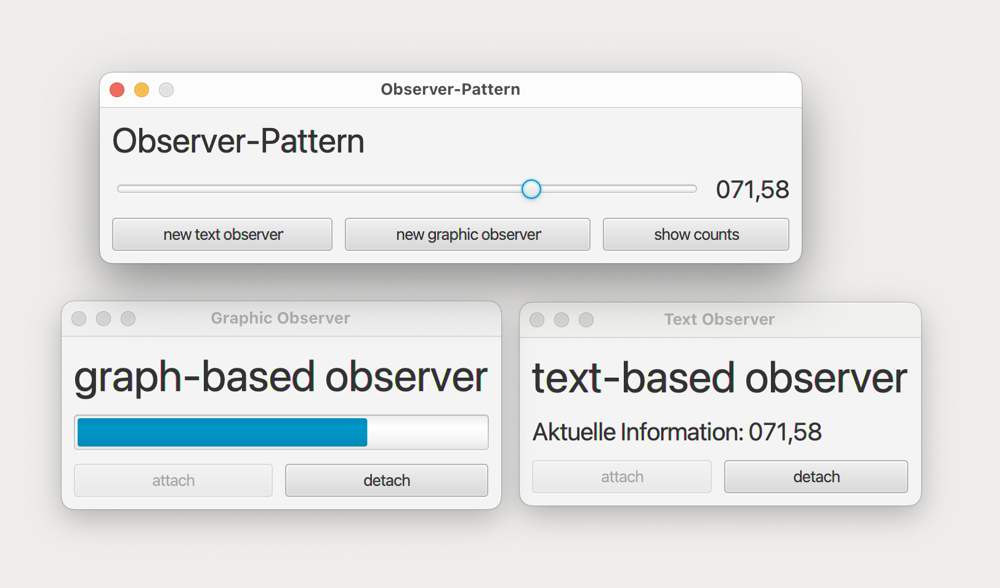

# Main (Main)

The program is a windowed GUI application to set a syncing variable in different styles. It is utilizing the Singleton Pattern from 10.1 and adds the Observer and Adapter Schemes on top to manage multiple software components in parallel.

## Observer

The Observer pattern is a design pattern used in software engineering to notify interested objects about changes to an observed subject. The observed subject, or Observable, maintains a list of interested observers and provides an interface for expressing and withdrawing interest. When a state change occurs, the subject actively reports the change to all interested parties. The Observer pattern can use push or pull notification principles, with push providing updated data along with the notification.

## Adapter

The Adapter pattern is a design pattern used in software engineering to enable communication between incompatible interfaces. It translates the interface of one class into another. Adaptation can be achieved through inheritance or delegation. In this project, an adapter is used to couple an implementation of the Observer pattern to the event system of Java FX using delegation. The Adapter pattern allows for a flexible and modular design, facilitating changes and extensions to the application.

## GUI

